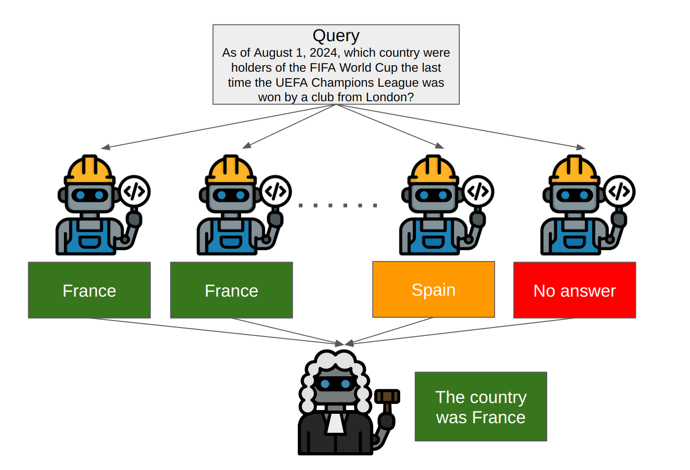

# 🔍 OpenDeepSearch: Democratizing Search with Open-source Reasoning Models and Reasoning Agents 🚀  🍏 ApplePie Submission

Contributors: **Severin Bratus**, **David Dinucu-Jianu**, **Ilias Mc Auliffe**
# Our results are available in this repo in `full_eval.json`!

# The write-up is in `Datathon_Writeup.pdf` and the presentation is in `AI_Agent_Self_Consistency_Presentation.pdf`.



---

## 🧠 Methodology

We made the following contributions on top of the existing open-source **OpenDeepResearch** framework:

### 🛠️ 1. CodeAgent Upgrade  
We are using the`CodeAgent`. This significantly improved performance, especially on counting tasks or ones that required complex multihop reasoning when compared to the more basic `ToolCallingAgent`.

----

### 🧪 2. Self-Consistency via Ensemble of Agents  
Inspired by ensemble and self-consistency methods, we query the `CodeAgent` multiple times (up to 12) and use a "Judge" agent to synthesize the final answer. Here's how it works:

- Each query is sent multiple times to mimic an ensemble of independent agents.
- We stop generating new answers early if the same response is given 4 times — this improves efficiency.
- The final answer is composed by a separate **Judge Agent**, which considers the original query, the context, and all ensemble outputs.

This method improved accuracy dramatically and revealed that:
- **High agreement** among agents correlates with easier questions.
- **Disagreement** signals uncertainty and question difficulty.

---

### 🧠 3. Changing the Base LLMs  
We extensively tested several large models, including:
- `qwq-32b`
- `qwen2.5-72b`
- `llama-v3p3-70b-instruct`
- `qwen2p5-72b-instruct`

The best-performing combination from our limited testing was:
- **`qwq-32b` and `qwen2p5-72b-instruct`**

This combo achieved **71% accuracy** on Frames (evaluated using **Gemini Flash**), particularly when combined with the changes above.

---

### 4. How to use?


In order to use the agent you can do the following:
```python

# The model used for the Judge and Code Agent.
model = LiteLLMModel(
    "fireworks_ai/accounts/fireworks/models/qwen2p5-72b-instruct",
    temperature=0.7
)

# The actual search model tool.
search_agent = OpenDeepSearchTool(
    model_name="fireworks_ai/accounts/fireworks/models/qwq-32b", 
    reranker="jina"
)

# The code agent worker.
code_agent = CodeAgent(
    tools=[search_agent],
    model=model
)

# Our judge agent.
judge_agent = ToolCallingAgent(
    tools=[],
    model=model,
    prompt_templates=MAJORITY_VOTE_PROMPT
)

# Self consistent agent that combines multiple responses from the tool_agent using the judge_agent.
sc_agent = SelfConsistentAgent(
    tool_agent=code_agent,
    judge_agent=judge_agent,
)


# Sample prompt.
query = "What is the distance, in metres, between the Colosseum in Rome and the Rialto bridge in Venice"

# We specify how many different answers it should query from the code_agent.
sc_agent.ask_sync(query, n_samples=12)
```

Our evaluation script requires some manual handholding due to API timeouts. If you plan on reproducing the results we suggest doing batches of 100 problems and altering line `93` in the `test.py` file.

```python
ds = ds.shuffle(seed=43).select(range(0, 100))
```

alternatively you can disable the timeouts we have introduced for our help in the `ods_tool.py` and `sc_agent.py` and thus run as normaly on the whole dataset.